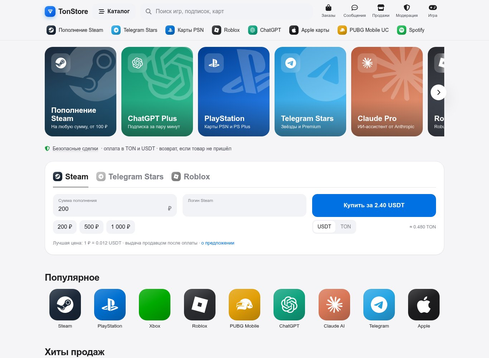
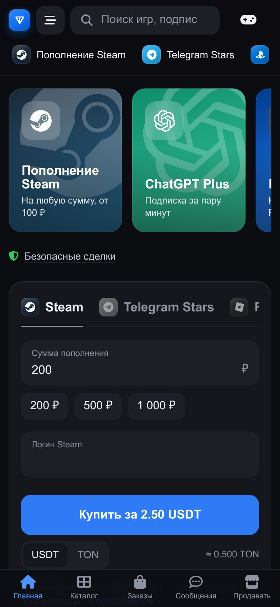
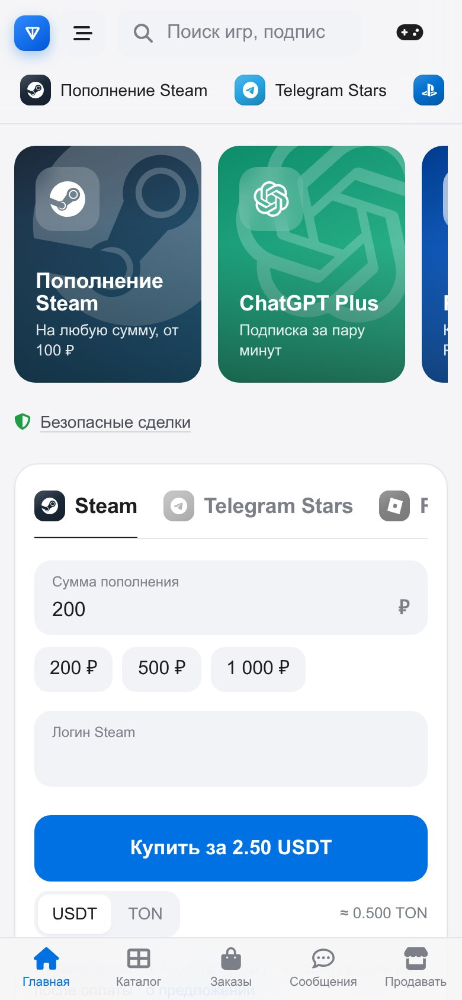
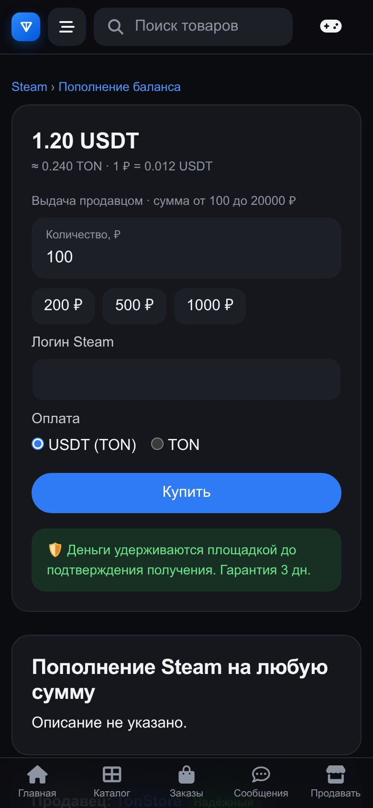
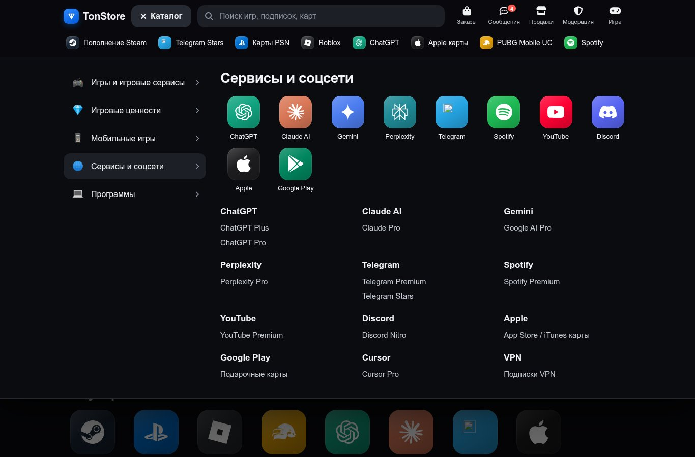
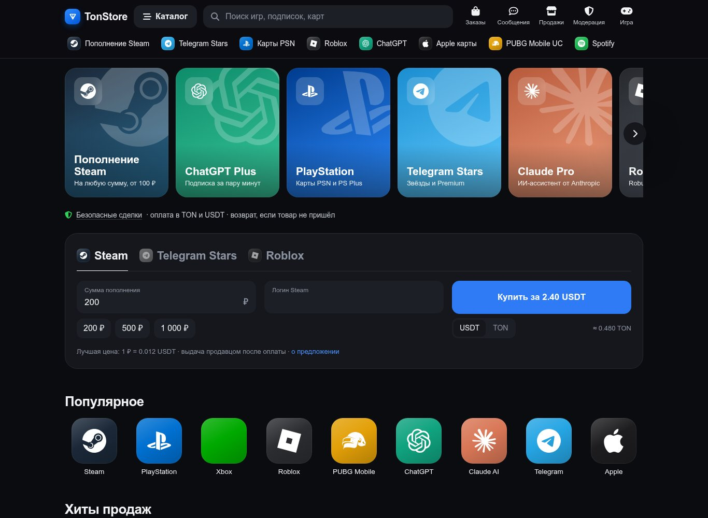
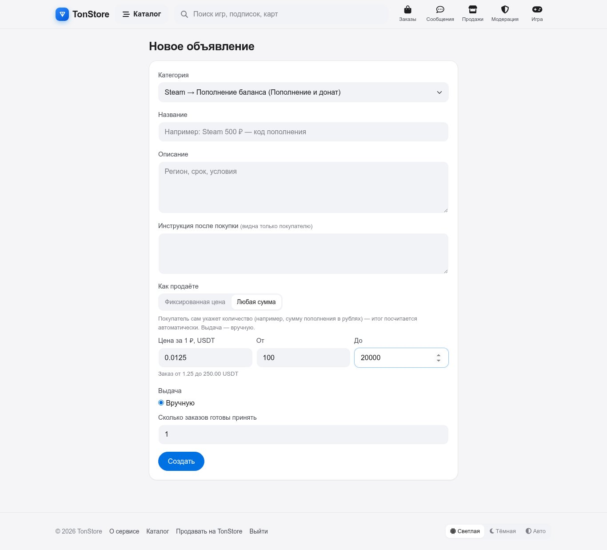
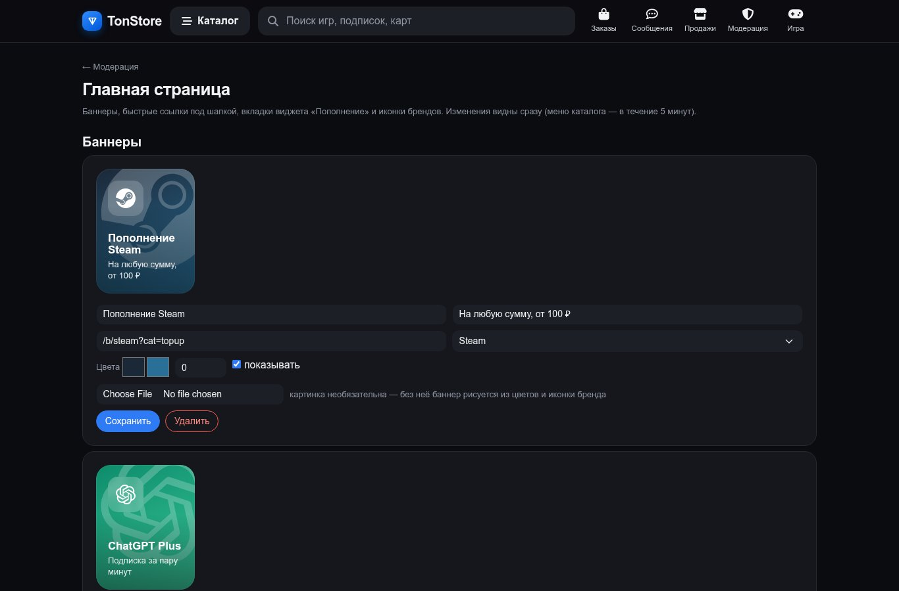
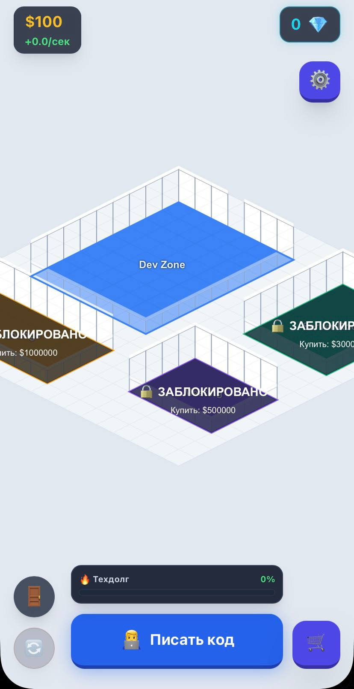
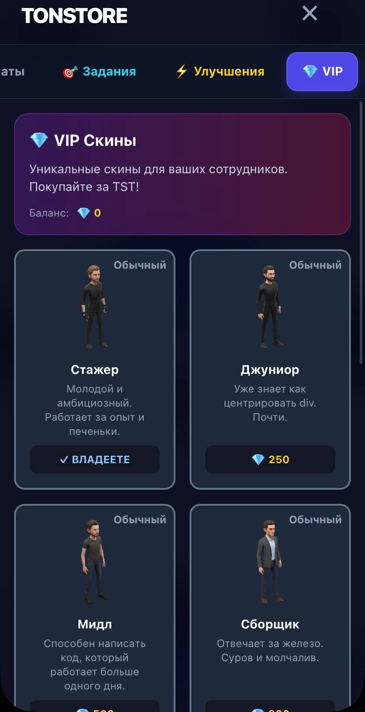

<div align="center">

# Иван Кулясов

### Full-Stack Developer · Telegram Mini Apps · Web3 / TON · GameFi

Создаю Telegram Mini Apps и backend-системы, где интерфейс, игровая механика
и реальные деньги в блокчейне работают как единый продукт.

**Python / Flask** · **Node.js / TypeScript** · **PostgreSQL** · **Firestore** · **TON** · **Telegram Web Apps**

[Проекты](#-проекты) · [Стек](#-стек) · [Контакты](#-контакты)

</div>

---

## 👨‍💻 О себе

Full-Stack разработчик. Специализация — **Telegram Mini Apps** с платежами в **TON / USDT**:
маркетплейсы с безопасными сделками, GameFi-экономика, серверная авторизация и защита от накруток.

Мне интересны задачи, где нужно довести продукт до продакшена целиком: схема базы, бизнес-логика денег,
интеграции (блокчейн, KYC, боты), UI/UX и тесты.

---

# 🚀 Проекты

## ⭐ TonStore — маркетплейс цифровых товаров за TON и USDT

> Маркетплейс внутри Telegram и на сайте: продавцы выставляют ключи, подарочные карты, подписки и пополнения,
> покупатели платят криптовалютой, а площадка удерживает деньги до получения товара (escrow).
> 🔗 [tonstore.onrender.com](https://tonstore.onrender.com) · репозиторий приватный

<div align="center">

</div>

<div align="center">



</div>

#### Что умеет
- 🛡️ **Безопасные сделки:** статусы заказа, таймеры автоподтверждения и автовозврата, споры с решением модератора.
- 💎 **Оплата TON и USDT (jetton):** фиксация курса, поиск платежа в блокчейне по комментарию, защита от повторного использования транзакции.
- 💸 **Автовыплаты продавцам и возвраты покупателям** с горячего кошелька площадки: офлайн-подпись (wallet v5r1), защита от двойной отправки по seqno и `valid_until`, дневные лимиты, аварийная пауза.
- 🔐 **TON Connect + ton_proof** для подтверждения кошелька продавца.
- 🪪 **KYC через Didit:** вебхуки с проверкой подписи, уровни продавцов с лимитами и удержанием средств.
- ⚡ **Автовыдача кодов:** шифрование (Fernet), уникальность кода по HMAC на всю площадку.
- 💬 **Чат покупатель–продавец** с фильтром контактов (антиобход площадки), отзывы и рейтинг магазинов.
- 🎛️ **Витрина как у крупных маркетплейсов:** мега-меню каталога, баннеры из админки, виджет «Пополнение» с подбором самого дешёвого предложения, товары «на любую сумму».
- 🌗 **Дизайн-система** на CSS-токенах: светлая/тёмная/авто тема (в Mini App — тема Telegram), полноэкранный режим, safe-area.

<div align="center">

</div>

<details>
<summary><b>Ещё скриншоты</b></summary>
<br>
<div align="center">
<br><br>
<br><br>

</div>
</details>

#### Как устроено
```text
Telegram Mini App / сайт ──initData (HMAC-SHA256)──► Flask ──► PostgreSQL
                                                       ├─ toncenter v3: входящие оплаты, состояние кошелька
                                                       ├─ горячий кошелёк: выплаты и возвраты (офлайн-подпись)
                                                       ├─ Didit: проверка личности продавцов
                                                       ├─ Telegram Bot API: уведомления
                                                       └─ cron → /tasks/tick: таймеры сделок и движок выплат
```
**Стек:** Python, Flask, psycopg 3, PostgreSQL, Jinja2, Bootstrap 5.3, TON Connect, tonutils/pytoniq-core, Render.
**Качество:** 5 наборов e2e-тестов на настоящем Postgres (сделки, продавцы, чат, выплаты, витрина), работа через PR и CI-деплой.

---

## 🎮 StoreTycoon: IT Empire — GameFi-тайкун в Telegram

> Idle/tycoon-игра про развитие IT-компании: сотрудники, оборудование, комнаты офиса, квесты, кланы и лиги.
> Игровая валюта TSP и премиальная TST, которая покупается за TON. Общий аккаунт с TonStore по Telegram ID.

<div align="center">


</div>

- 🛡️ **Server-authoritative архитектура:** клиент только показывает, все цены, доход и награды считает сервер в транзакции Firestore.
- 🧮 Серверная формула дохода, лимиты покупок по уровню компании, ограничение начисления дохода по времени (антиспидхак).
- 🏆 Кланы, лиги с кубками, квесты, рефералы, скины за TST, push-уведомления об офлайн-доходе.
- 🖼️ Изометрический рендер на HTML5 Canvas, весь клиент на Vanilla JS.

**Стек:** Node.js, Express, Vercel Serverless, Firebase Firestore (Admin SDK), HTML5 Canvas, Tailwind, Telegram Bot API.

---

## 💎 TonPay для StoreTycoon — покупка TST за TON

> Отдельный сервис оплаты игровой валюты: счёт → оплата через TON Connect → проверка в блокчейне → начисление.

- Начисление в транзакции: параллельные проверки не выдадут TST дважды.
- Хэш транзакции фиксируется — одна оплата засчитывается только одному счёту; сумма сверяется с ценой на сервере.
- Крон добивает оплаченные, но не проверенные счета; лимиты запросов и CORS по списку доменов.

**Стек:** Node.js, Vercel Serverless, Firestore, toncenter v3, TON Connect.

---

# 🧰 Стек

**Backend:** `Python` `Flask` `Node.js` `Express` `TypeScript` `REST API`

**Базы данных:** `PostgreSQL` `psycopg 3` `Firestore` `транзакции` `миграции`

**Telegram и Web3:** `Telegram Mini Apps` `Bot API` `TON` `USDT jetton` `TON Connect` `ton_proof` `wallet v5r1` `toncenter`

**Frontend:** `HTML5 Canvas` `JavaScript` `Bootstrap 5.3` `Tailwind` `CSS design tokens`

**Безопасность:** `HMAC-SHA256` `CSRF` `escrow` `KYC (Didit)` `шифрование Fernet` `антифрод`

**Инфраструктура и качество:** `Git / PR flow` `Render` `Vercel` `e2e-тесты`

---

# 🎓 Образование

**СПО — Информационные системы и программирование**
Окончено

**ВПО — Разработка информационных систем и систем искусственного интеллекта**
Бакалавриат · в процессе

---

# 📬 Контакты

<div align="center">

### Открыт к интересным проектам и сотрудничеству

**Telegram:** [@fr0gsel](https://t.me/fr0gsel)

**Email:** [ivanculyasov@yandex.ru](mailto:ivanculyasov@yandex.ru)

</div>

---

<div align="center">

*Building products where code, games and Web3 meet.*

</div>
