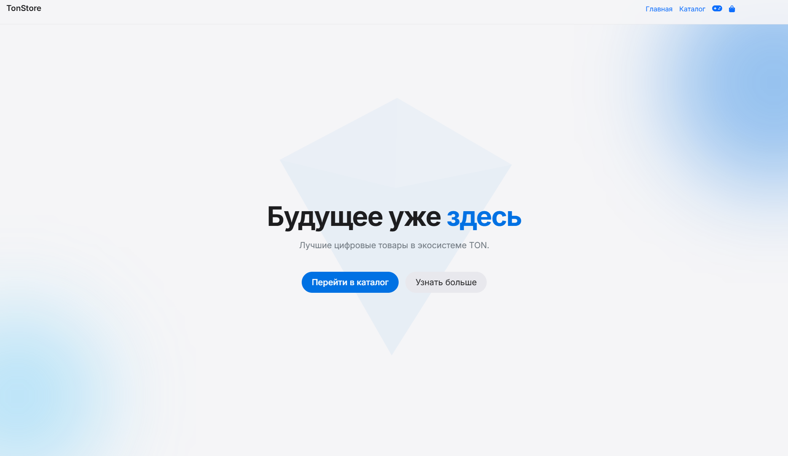
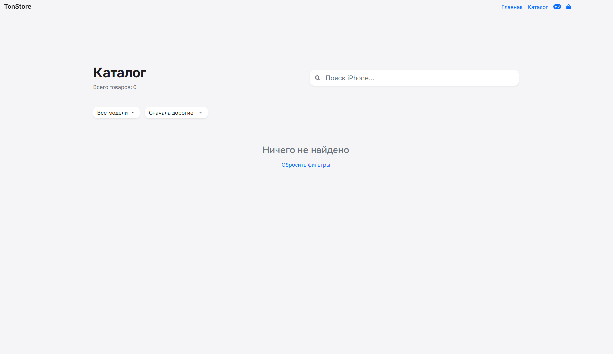
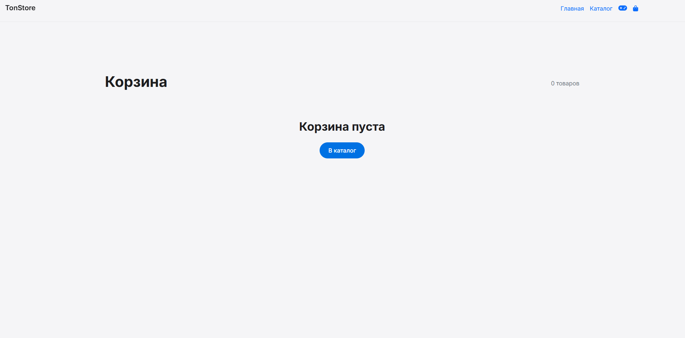

<div align="center">

# Иван Кулясов

### Full-Stack Developer · Telegram Mini Apps · Web3 · GameFi

Создаю Telegram Mini Apps и backend-системы с асинхронной архитектурой,
игровой логикой, Web3-интеграциями и финансовыми операциями.

**Telegram Mini Apps** · **Web3 / TON** · **GameFi** · **Backend**

[Telegram](#-контакты) · [Email](#-контакты) · [Featured Project](#-featured-project)

</div>

---

## 👨‍💻 О себе

Full-Stack Developer, специализирующийся на разработке **Telegram Mini Apps**, асинхронных backend-систем и Web3-сервисов.

Основной интерес — проекты, где frontend, backend, игровая механика и финансовая логика должны работать как единая система.

Работаю с Python/Flask и Node.js/Express, PostgreSQL и Firestore, Telegram Web Apps, TON Blockchain и серверной авторизацией.

---

# 🚀 Featured Project

## TonStore & StoreTycoon

> Гибридная Web3-экосистема внутри Telegram, объединяющая **e-commerce магазин** и **GameFi-тайкун** в единую экономику.

### 🛍️ TonStore — E-Commerce

Веб-магазин цифровых товаров с каталогом, корзиной, заказами и интеграцией платежей через TON.

<div align="center">



</div>

#### Основные возможности

- 📦 Каталог и вариативные товары
- 🛒 Корзина и обработка заказов
- 🗄️ PostgreSQL для хранения данных
- 💎 TON-платежи
- 🤖 Telegram Web App integration
- 📱 Адаптация интерфейса под мобильные устройства

<div align="center">




</div>

---

### 🎮 StoreTycoon — GameFi

Игровой tycoon, встроенный в Telegram Mini App.

Игровая логика построена по принципу **Server-Authoritative Architecture**: клиент не является источником правды, а сервер валидирует игровые действия и изменения состояния.

<div align="center">


</div>

#### Игровая экономика

- 💰 Генерация и управление ресурсами
- 🏗️ Покупка и развитие игровых зон
- ⚡ Система улучшений
- 💎 VIP-скины и внутриигровые предметы
- 🪙 TST token economy
- 🔄 Атомарные операции с игровым состоянием
- 🛡️ Серверная валидация игровых действий

---

## 🏗️ Архитектура

```text
                         ┌─────────────────────┐
                         │    Telegram User    │
                         └──────────┬──────────┘
                                    │
                                    ▼
                         ┌─────────────────────┐
                         │   Telegram Mini App │
                         └──────────┬──────────┘
                                    │
                    ┌───────────────┴───────────────┐
                    │                               │
                    ▼                               ▼
          ┌─────────────────┐             ┌─────────────────┐
          │    TonStore     │             │  StoreTycoon    │
          │  Python / Flask │             │ Node.js /       │
          │                 │             │ Express         │
          └────────┬────────┘             └────────┬────────┘
                   │                               │
                   ▼                               ▼
          ┌─────────────────┐             ┌─────────────────┐
          │   PostgreSQL    │             │    Firestore    │
          └────────┬────────┘             └────────┬────────┘
                   │                               │
                   └───────────────┬───────────────┘
                                   │
                                   ▼
                         ┌─────────────────────┐
                         │   Web3 / Payments   │
                         │  TON · TST · Coinbase│
                         └─────────────────────┘
```

---

## 🔐 Engineering Highlights

### Server-Authoritative Game Engine

Игровое состояние хранится и изменяется на сервере.

```text
Client Action
      │
      ▼
Server Validation
      │
      ▼
Game Logic
      │
      ▼
Atomic Transaction
      │
      ▼
Updated State
      │
      ▼
Client Response
```

Такой подход позволяет не доверять клиенту баланс, награды и другие критичные игровые значения.

### 🔑 Telegram Authentication

Для проверки Telegram-сессий используется криптографическая валидация `initData` через **HMAC-SHA256**.

### 💾 Data Integrity

Для GameFi-логики используются транзакции Firestore и атомарные обновления состояния.

### 💎 Web3

Интеграция с экосистемой TON включает:

- TON payments
- `ton://` links
- Base64 QR-коды
- Tonkeeper API
- TST token economy
- Coinbase Commerce

### 📱 Mobile UX

Интерфейс адаптирован под Telegram Mini Apps и мобильные устройства:

- Responsive UI
- Glassmorphism
- iOS Safe Area
- Dynamic Island adaptation
- Full-screen iframe overlay
- Mobile-first interaction

---

# 🧰 Tech Stack

### Backend

`Python` `Flask` `Node.js` `Express` `Asyncio` `REST API`

### Databases

`PostgreSQL` `psycopg` `Firestore` `Transactions` `Atomic Updates`

### Telegram & Web3

`Telegram Web Apps` `python-telegram-bot` `TON` `Tonkeeper` `Coinbase Commerce`

### Frontend

`HTML5` `CSS3` `JavaScript` `Bootstrap 5` `Glassmorphism UI`

### Security & Architecture

`HMAC-SHA256` `Server-Authoritative Architecture` `Transactional Game Engine`

### DevOps

`Git` `GitHub Actions` `Render` `Vercel`

---

# 🎓 Образование

**СПО — Информационные системы и программирование**  
Окончено

**ВПО — Разработка информационных систем и систем искусственного интеллекта**  
Бакалавриат · в процессе

---

# 📬 Контакты

<div align="center">

### Буду рад обсудить интересные проекты

**Telegram:** [@fr0gsel]

**Email:** [ivanculyasov@yandex.ru]

</div>

---

<div align="center">

*Building products where code, games and Web3 meet.*

</div>
